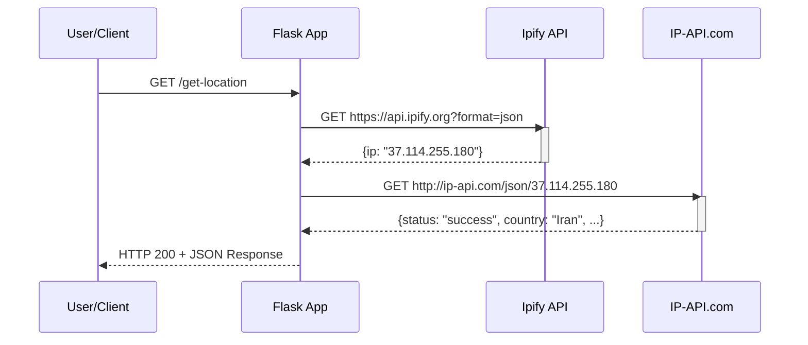
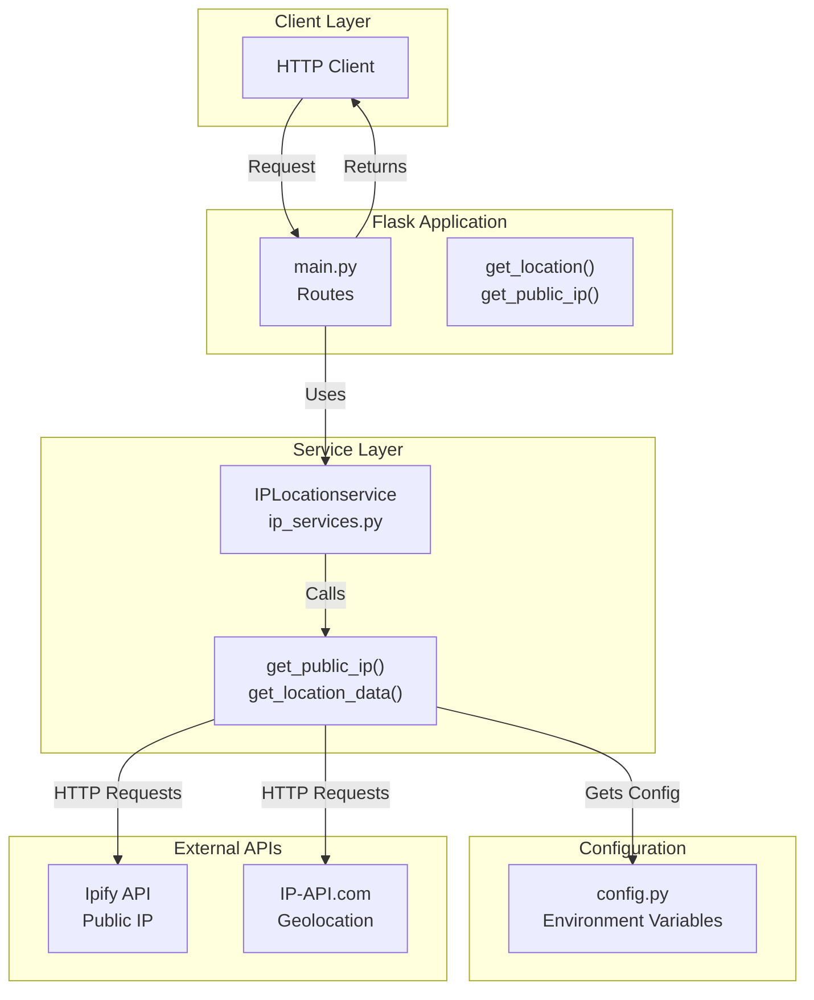
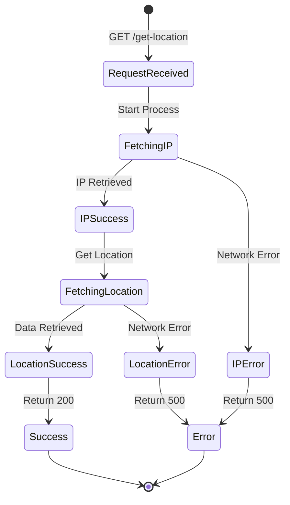
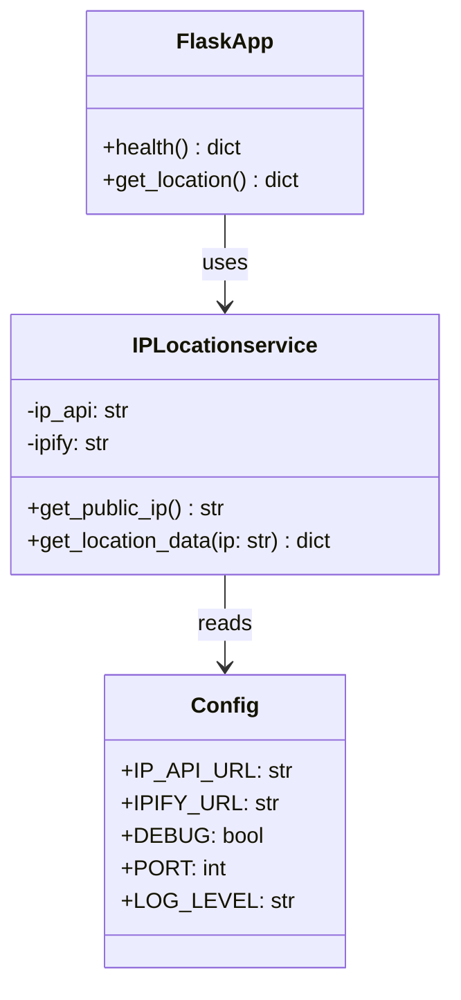

# Application Flow Diagram

## Sequence Diagram: Request to Response

## Component Diagram: Architecture

## State Diagram: Request States

## Data Flow: Request to Response

```mermaid
flowchart LR
    A["Client Request<br/>GET /get-location"] -->|HTTP| B["Flask Route<br/>@app.route"]
    
    B -->|Call| C["get_public_ip()"]
    
    C -->|Request| D["Ipify API"]
    D -->|Response| E["Extract IP<br/>37.114.255.180"]
    
    E -->|Pass IP| F["get_location_data(ip)"]
    
    F -->|Request| G["IP-API.com"]
    G -->|Response| H["Parse Geolocation<br/>JSON"]
    
    H -->|Return| I["jsonify()"]
    
    I -->|HTTP 200| J["Client Response<br/>Geolocation Data"]
    
    style A fill:#e1f5ff
    style J fill:#c8e6c9
    style D fill:#fff9c4
    style G fill:#fff9c4
```

## Class Diagram: Data Structure

